# Air Quality Dashboard



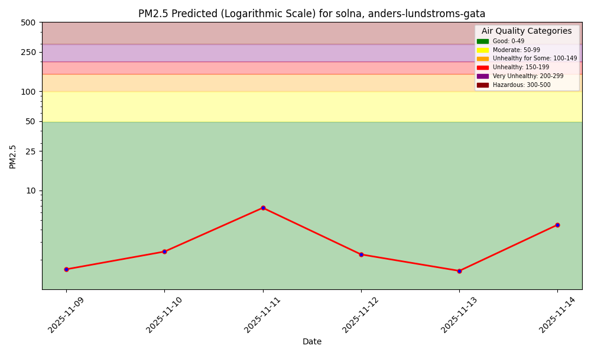

There is also a Python program to interact with the air quality ML system using language (text, voice),
powered by a [function-calling LLM](https://www.hopsworks.ai/dictionary/function-calling-with-llms).

# Model Performance Monitoring

1-Day Hindcast: Predictions vs Outcomes

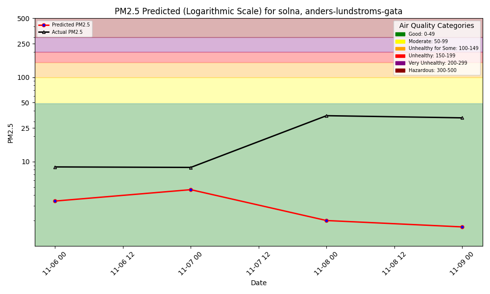

# Air Quality Dashboard Edinburgh (Part A)

## Forecast

### Balmwell Terrace
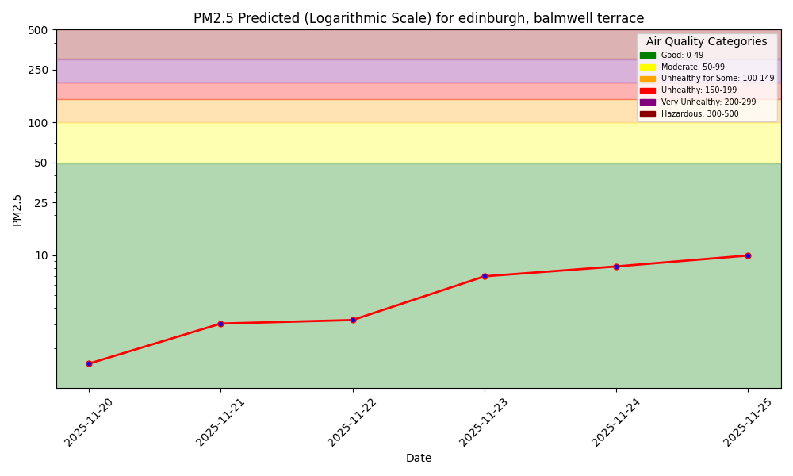

### Queensferry Road
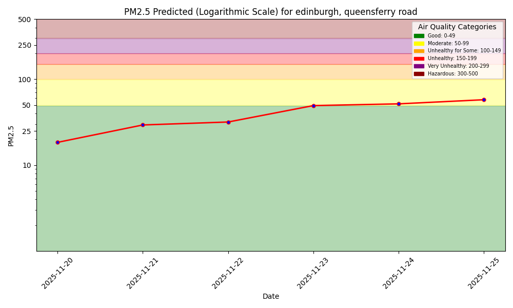

### Salamander St

### St John's Road

### St Leonards

### Tower Street
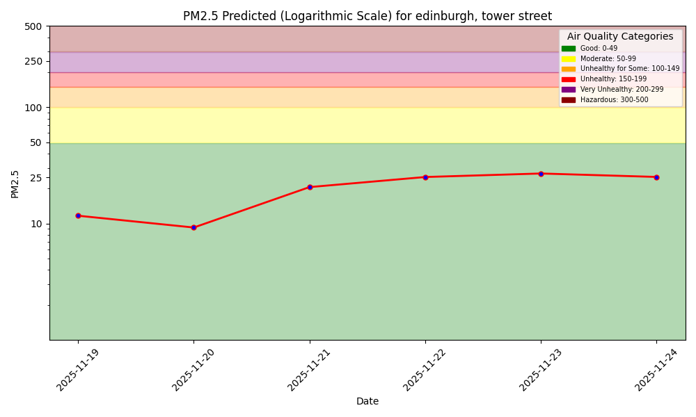

## Hindcast

### Balmwell Terrace
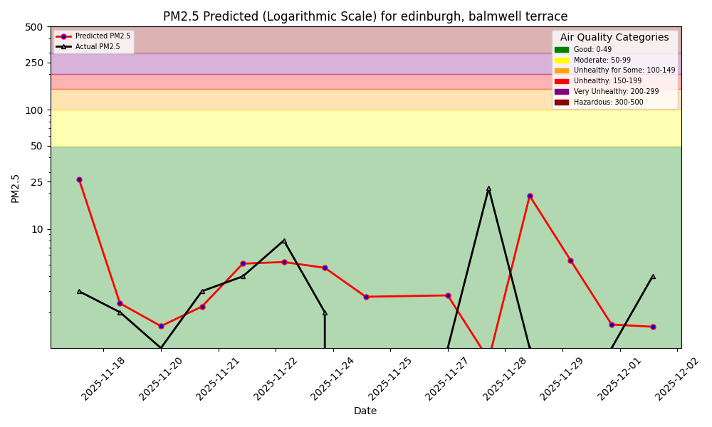

### Queensferry Road
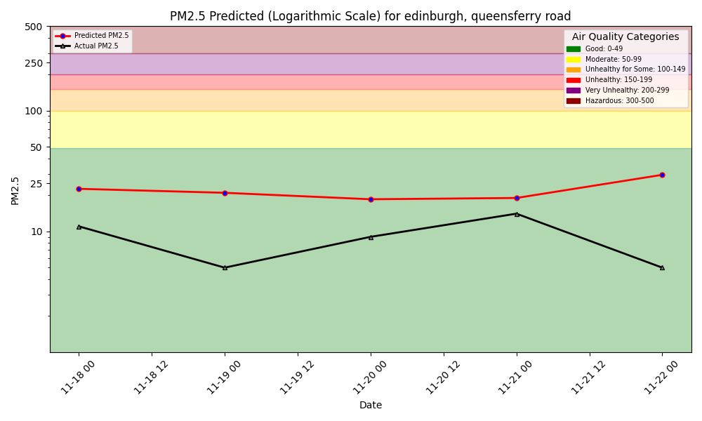

### Salamander St
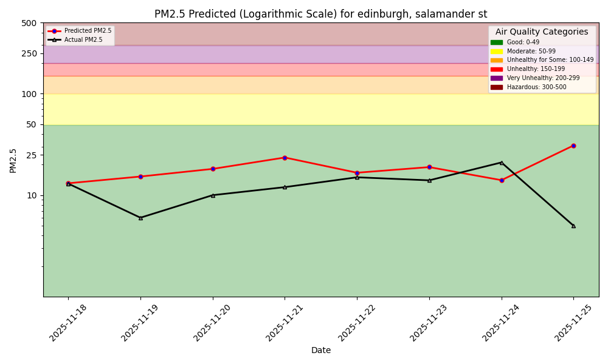

### St John's Road
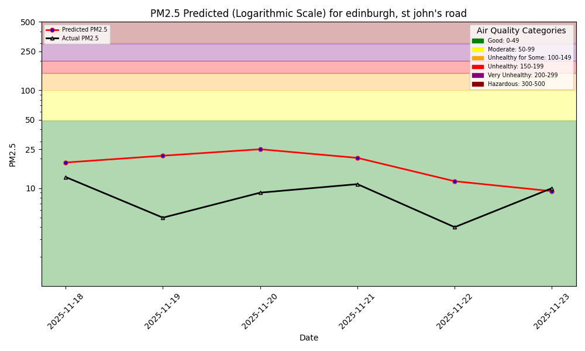

### St Leonards
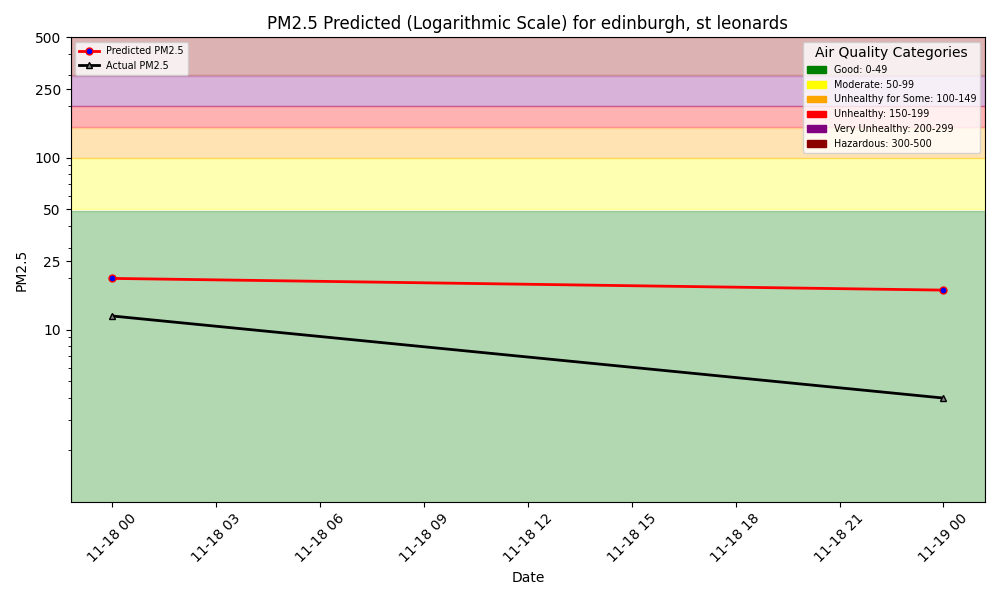

### Tower Street
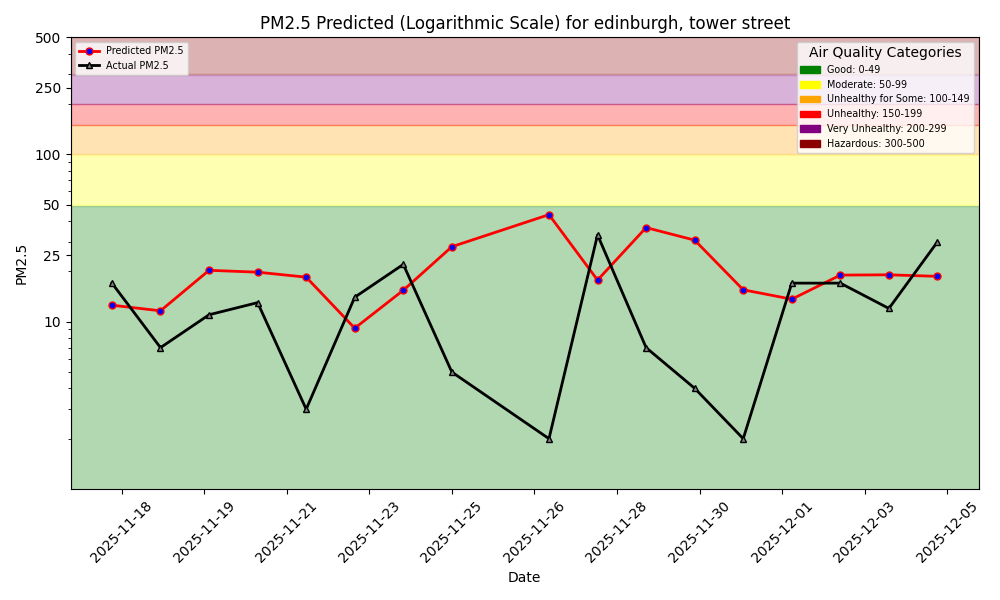

